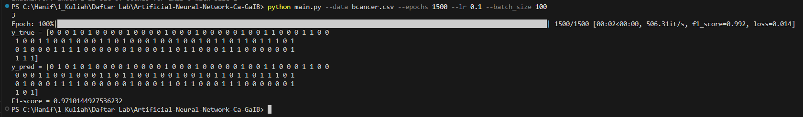

# Artificial-Neural-Network-Ca-GaIB
Artificial Neural Network implementation in Python.

## Table of Contents
* [General Info](#general-information)
* [Technologies Used](#technologies-used)
* [How to run](#how-to-run)
* [Screenshots](#screenshots)


## General Information
Implementation of Artificial Neural Network in python. The type of the implemented ANN is a L-layer Feedforward Neural Network. The first layer until the (L-1)th layer use ReLU activation function. The last layer use sigmoid activation function. The optimizer used in the model is an Gradient Descent Algorithm (You can change it to SGD or Mini-batch GD based on the batch-size hyperparameter). The number of layers and the number of units per layer can be modified via source code. You can change it by changing the numbers in the layer array in main.py. Current supported data is [Breast Cancer](https://www.kaggle.com/datasets/uciml/breast-cancer-wisconsin-data) dataset only.


## Technologies Used
- python - version 3.10
- pandas - version 1.4.3
- numpy - version 1.21.6

## How to run
Use this command in the root directory of the repository
```
python main.py --data <csv-filename> --epochs <number-of-epochs> --lr <learning-rate> --batch_size <number-of-batch-size>
```
Example:
```sh
python main.py --data bcancer.csv --epochs 1500 --lr 0.1 --batch_size 100
```

## Screenshots
